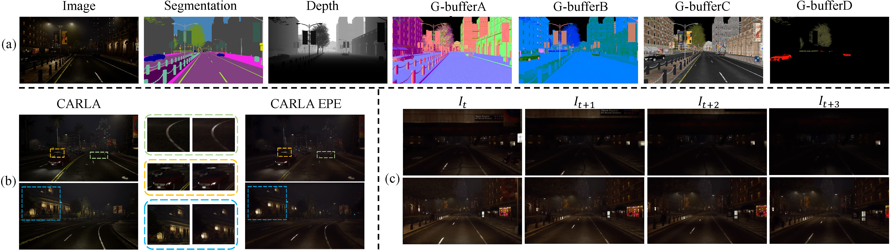

# STEPS: Joint Self-supervised Nighttime Image Enhancement and Depth Estimation (ICRA 2023)
Yupeng Zheng, Chengliang Zhong, Pengfei Li, Huan-ang Gao, Yuhang Zheng, Bu Jin, Ling Wang, Hao Zhao, Guyue Zhou, Qichao Zhang and Dongbin Zhao

State Key Laboratory of Multimodal Artificial Intelligence Systems, Institute of Automation, Chinese Academy of Sciences; Institute for AI Industry Research (AIR), Tsinghua University

## Introduction

This is the official repository for *STEPS: Joint Self-supervised Nighttime Image Enhancement and Depth Estimation*. You can find our paper at [arxiv](https://arxiv.org/abs/2302.01334). In this repository, we release the RobotCar-Night and nuScenes-Night dataset, as well as the code.


## Installation

1. Create conda environment:

```
$ conda create -n STEPS python=3.7
$ conda activate STEPS
```

2. This code was implemented with python 3.7, torch 1.8.0+cu111 and pytorch-lightning==1.6.4
```
$ pip install torch==1.8.0+cu111 torchvision==0.9.0 torchmetrics==0.9.0 -f https://download.pytorch.org/whl/torch_stable.html 
$ pip install pytorch-lightning==1.6.4
```

3. Install other dependency
```
$ pip install -r requirements.txt
```

## Dataset

For data preparation of RobotCar-Night and nuScenes-Night datasets, we follow the dataset used in "Regularizing Nighttime Weirdness: Efficient Self-supervised Monocular Depth Estimation in the Dark" |[pdf](https://arxiv.org/abs/2108.03830), [github](https://github.com/w2kun/RNW)|. Our work is based on [RobotCar](https://robotcar-dataset.robots.ox.ac.uk) and [nuScenes](https://www.nuscenes.org/nuscenes).  `(2014-12-16-18-44-24, 2014-12-09-13-21-02)` of RobotCar and `(Package 01, 02, 05, 09, 10)` of nuScenes is enough for running the code. You can use the above official toolboxes produce the ground truth depth. Or you can download our pre-processed groudtruth and denoised dataset [here](https://drive.google.com/drive/folders/1n2WsaGtB-tRiPyee-vAYF6Cd7EZr4RGe).


After preparing datasets, we strongly recommend you to organize the directory structure as follows. The split files are provided in `split_files/`.

```
STEPS
data
|__RobotCar-Night
   |__Package name (e.g. 2014-12-16-18-44-24)
      |__depth (to store the .npy ground truth depth maps)
         |__ground truth depth files
      |__rgb (to store the .png color images)
         |__color image files
      |__intrinsic.npy (to store the camera intrinsics)
      |__test_split.txt (to store the test samples)
      |__train_split.txt (to store the train samples)
   nuScenes-Night
   |__sequences (to store sequence data)
      |__video clip number (e.g. scene-1091)
         |__file_list.txt (to store the image file names in this video clip)
         |__intrinsic.npy (to store the camera intrinsic of this video clip)
         |__image files described in file_list.txt
   |__splits (to store split files)
      |__split files with name (day/night)_(train/test)_split.txt
   |__test
      |__color (to store color images for testing)
      |__gt (to store ground truth depth maps w.r.t color)
```

## Train
1. For the nuScenes-Night dataset, we strongly recommend you to denoise first. We using AP-BSN |[pdf](https://arxiv.org/abs/2203.11799), [github](https://github.com/wooseoklee4/AP-BSN)| to preprocess both train and test dataset. Or you can download our pre-processed dataset from the above link
2. Train a self-supervised model on daytime data, by

   ```shell
   sh scripts/train_(rc/ns).sh
   ```
3. Change config name in train_(rc/ns).sh
4. Train STEPS by

   ```shell
   sh scripts/train_(rc/ns).sh
   ```

In default, checkpoints will be saved every two epochs.

## Test
To test on RobotCar-Night or nuScenes-Night, you can run

```shell
sh scripts/test_(rc/ns).sh
```
For a quick test, you can download pretrained [checkpoints](https://drive.google.com/drive/folders/16bqgIYBDg4dd9eGFWYL6Cyp5xCs4-DbI) of of our method to `./best`.

1. Test on nuScenes(without denoising)
```shell
+---------------------------------------------------------------------------+
|                             Evaluation Result                             |
+---------------------------------------------------------------------------+
|  abs_rel  |  sq_rel  |   rmse  |  rmse_log  |    a1   |    a2   |    a3   |
+---------------------------------------------------------------------------+
|   0.303   |  3.522   |  9.201  |   0.390    |  0.551  |  0.791  |  0.901  |
+---------------------------------------------------------------------------+
```

2. Test on nuScenes(with denoising)
```shell
+---------------------------------------------------------------------------+
|                             Evaluation Result                             |
+---------------------------------------------------------------------------+
|  abs_rel  |  sq_rel  |   rmse  |  rmse_log  |    a1   |    a2   |    a3   |
+---------------------------------------------------------------------------+
|   0.292   |  3.371   |  9.126  |   0.382    |  0.572  |  0.805  |  0.908  |
+---------------------------------------------------------------------------+
```

3. Test on RobotCar
```shell
+---------------------------------------------------------------------------+
|                             Evaluation Result                             |
+---------------------------------------------------------------------------+
|  abs_rel  |  sq_rel  |   rmse  |  rmse_log  |    a1   |    a2   |    a3   |
+---------------------------------------------------------------------------+
|   0.170   |  1.686   |  6.797  |   0.234    |  0.758  |  0.923  |  0.968  |
+---------------------------------------------------------------------------+
```

## EPE Dataset
We propose CARLA-EPE, a photo-realistically enhanced nighttime dataset based upon CARLA. We leverage the stateof-the-art photorealism enhancement network [EPE](https://isl-org.github.io/PhotorealismEnhancement/) to transfer the style of the rendered images to a photorealistic one, resulting in a photorealistic nighttime dataset CARLA-EPE with dense ground truth of depth. You can download the whole dataset [here](https://drive.google.com/drive/folders/1n2WsaGtB-tRiPyee-vAYF6Cd7EZr4RGe).



## Citation
If you find this work useful for your research, please cite our paper:
```shell
todo
```

## Acknowledgement
We would like to thank the reviewers for their constructive comments and the authors of [SCI](https://openaccess.thecvf.com/content/CVPR2022/html/Ma_Toward_Fast_Flexible_and_Robust_Low-Light_Image_Enhancement_CVPR_2022_paper.html) and [RNW](https://arxiv.org/abs/2108.03830) for their help and suggestions.
This work was supported by the National Natural Science Foundation of China (NSFC) under Grants No. 62173324 and Tsinghua-Toyota Joint Research Fund (2022393009). 
